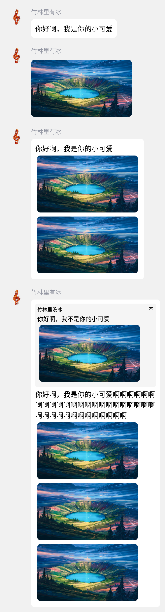

# qq-quote-generator

> 基于竹林里有冰的 [zhullyb/qq-quote-generator](https://github.com/zhullyb/qq-quote-generator) ，使用 fastapi 和 playwright 重写的异步版本，性能或许会更好一点？

一个基于 headless firefox 实现的 qq 聊天语录图片生成 api，灵感来源于 telegram 的 [quote-bot](https://github.com/LyoSU/quote-bot)。

## 使用方法
### 网页版示例（功能不全）
https://qq.aya1.eu.org/

https://qq.aya1.eu.org/?user_id=1659870350&user_nickname=Cafe+aya%7E&message=%E5%89%8D%E7%AB%AF%E5%86%99%E4%B8%8D%E6%9D%A5&img_type=jpeg

### 运行：
1. 使用docker：
```bash
docker run --name qq-quote -d -p 5000:5000 brx86/qq-quote-generator
```
2. 使用docker-compose：
```bash
git clone https://github.com/Brx86/qq-quote-generator
cd qq-quote-generator
docker compose up -d
```
### 请求：
使用 POST 请求 /png 或 /jpeg 或 /base64，将会根据请求的路径返回对应格式的图片或图片的 base64 编码，消息体中需要携带 json 数据，具体的数据样例可以参考 [data_example.json](./data_example.json)

其中 user_id 和 user_nickname 为必填字段，message 与 image 需选择一个以上；如果 json 数据中含有 reply，则 reply 中的 user_nickname 为必填字段，reply 中的 message 与 image 需选择一个以上。

以下是由 data_example.json 生成的图片预览


